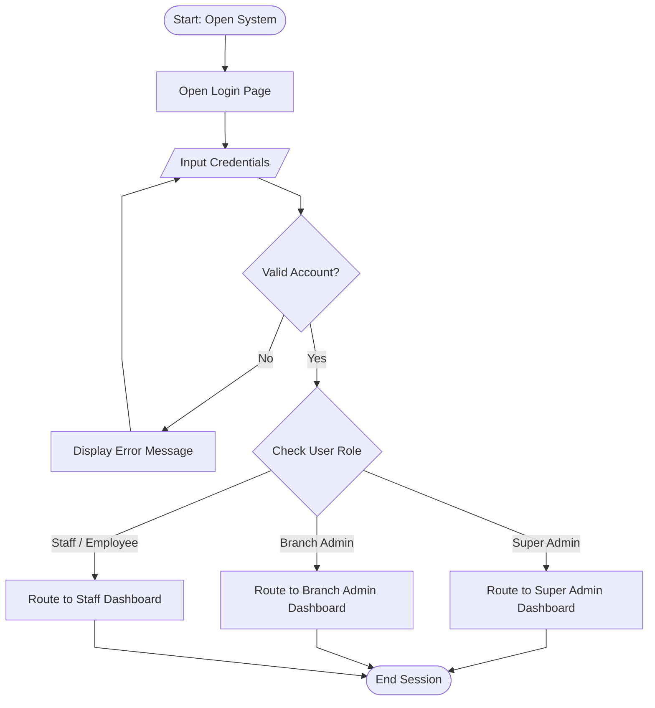
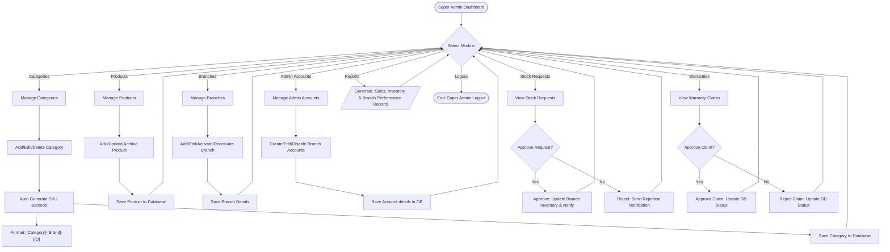
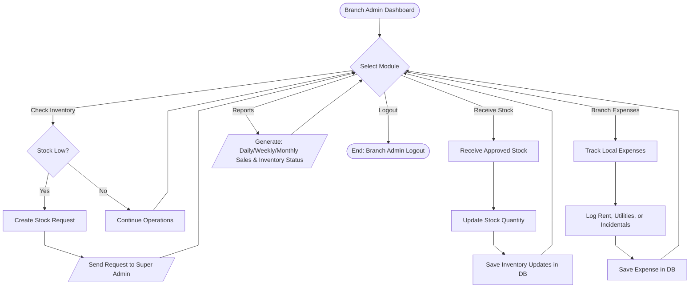
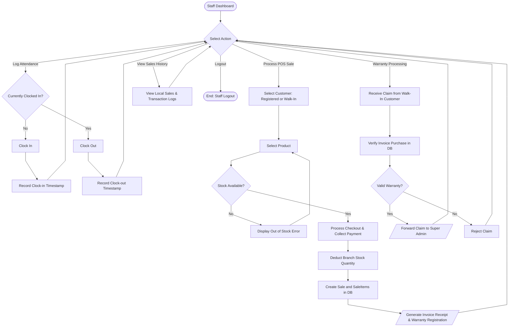
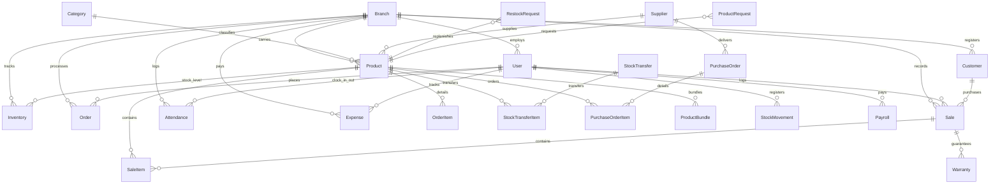
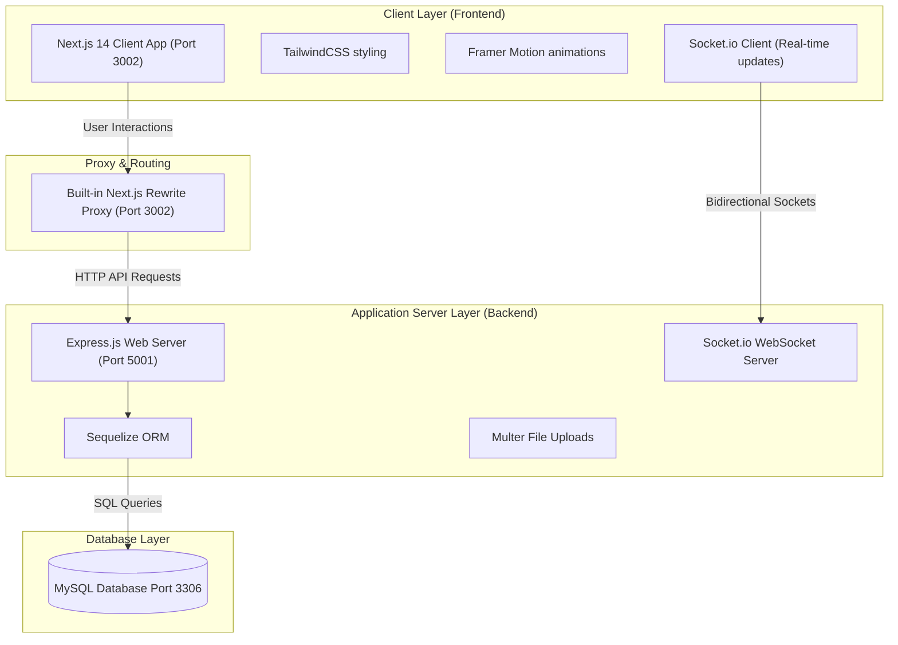

# Capstone Presentation: PC Parts Inventory & Sales Management System

This document separates the core workflows and architecture of the **PC Parts Inventory and Sales Management System** into six clear figures. This modular approach avoids overlapping lines, ensures readability, and follows professional standards for a capstone defense.

---

## Figure 1: System Overview Flowchart (High-Level)

This diagram outlines the high-level system entry gate, credential verification, and role-based routing for **Super Admin**, **Branch Admin**, and **Staff**.

---

## Figure 2: Super Admin Process Flow

This diagram traces the administrative capabilities of the Super Admin, including catalog management, barcode SKU generation, stock requests, and analytics.

---

## Figure 3: Branch Admin Process Flow

This diagram outlines the branch-level administrative processes, stock level monitoring, and local branch reporting. *(Note: Sales and POS checkouts are managed exclusively by Staff).*

---

## Figure 4: Staff Process Flow

This diagram maps out the staff workflows, including shifts attendance logging, the Point-of-Sale (POS) checkout process, sales history reviews, and initial customer warranty screenings.

---

## Figure 5: Database Relationship Diagram (ERD)

This diagram shows how tables connect through primary and foreign keys. (Customers are registered in the DB for transaction tracing but do not log in).

---

## Figure 6: System Architecture Diagram

This diagram displays the structural boundary of the system stack, detailing proxy behaviors and data retrieval connections.

