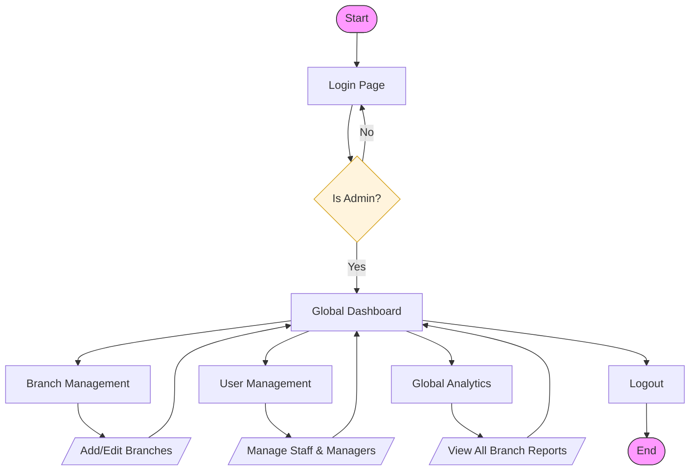
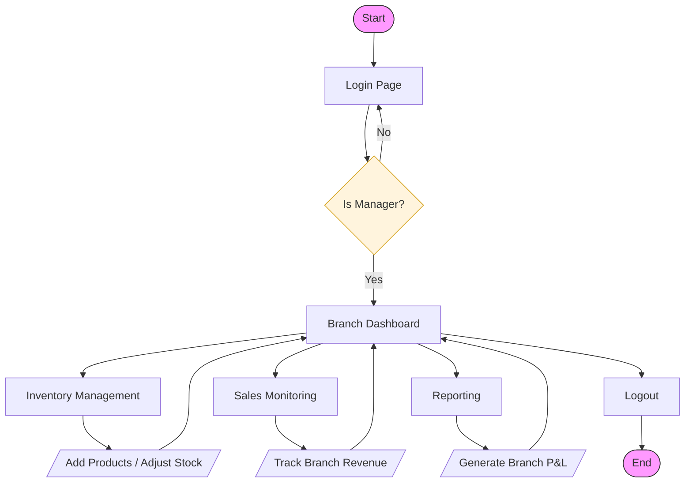
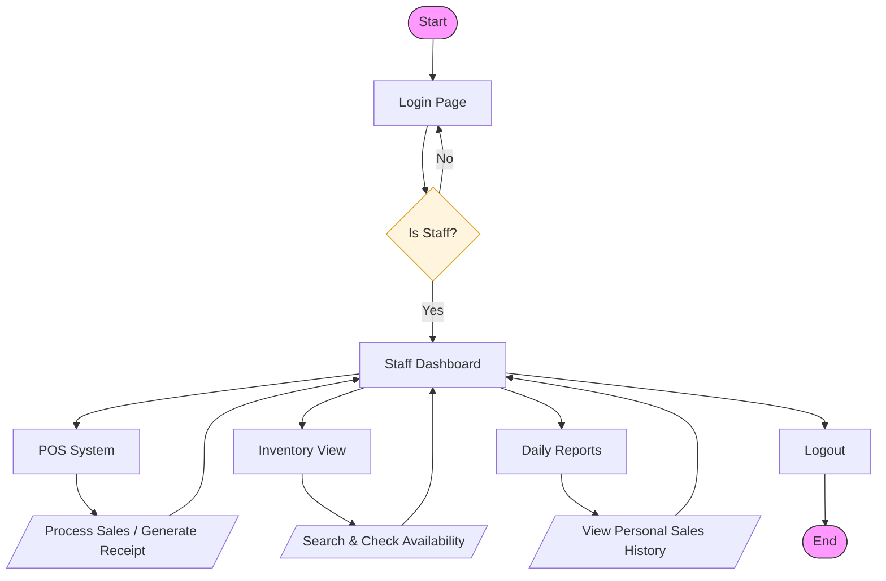

# Role-Based System Flowcharts

This document provides separate functional flowcharts for each user role in the PC Alley ERP system.

---

## 1. Admin (Super Admin) Flowchart
The Admin has global oversight and manages the system infrastructure.

---

## 2. Manager (Branch Manager) Flowchart
The Manager focuses on branch-specific inventory and operational performance.

---

## 3. Staff Flowchart
The Staff role is focused on customer-facing tasks and day-to-day operations.

