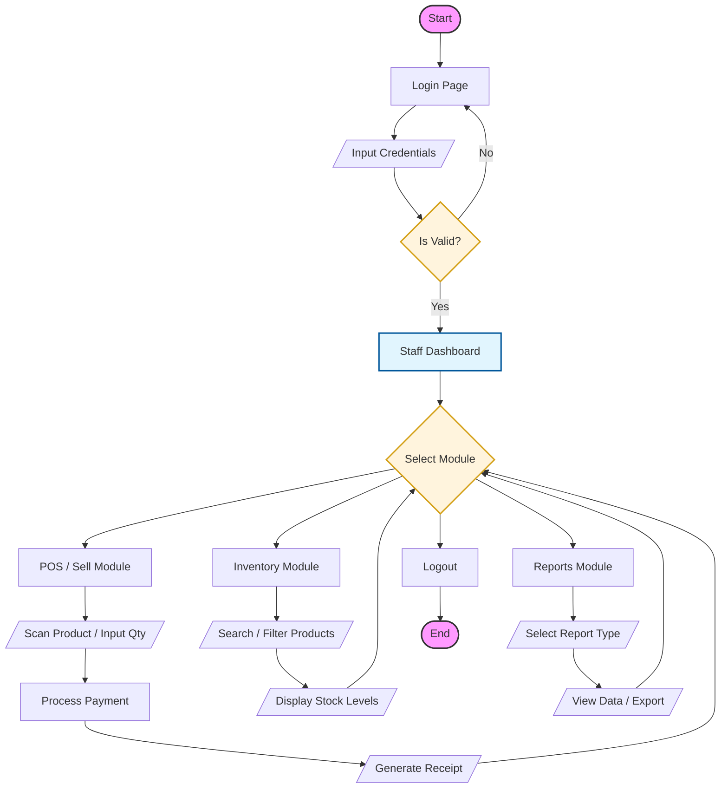

# Simplified System Flowchart (Staff)

This flowchart represents the standard user journey for Staff members within the PC Alley ERP system, using standard logic symbols.

```mermaid
flowchart TD
    %% Define Nodes
    Start([Start])
    Login[Login Page]
    Input[/Input Credentials/]
    Valid{Is Valid?}
    Dash[Staff Dashboard]
    
    Choice{Select Module}
    
    %% POS Flow
    POS[POS / Sell Module]
    Scan[/Scan Product / Input Qty/]
    Process[Process Payment]
    Receipt[/Generate Receipt/]
    
    %% Inventory Flow
    Inv[Inventory Module]
    Search[/Search / Filter Products/]
    Display[/Display Stock Levels/]
    
    %% Reports Flow
    Rep[Reports Module]
    SelectRep[/Select Report Type/]
    View[/View Data / Export/]
    
    Logout[Logout]
    End([End])

    %% Main Flow
    Start --> Login
    Login --> Input
    Input --> Valid
    
    Valid -- No --> Login
    Valid -- Yes --> Dash
    
    Dash --> Choice
    
    %% Module Branching
    Choice --> POS
    Choice --> Inv
    Choice --> Rep
    
    %% POS Details
    POS --> Scan
    Scan --> Process
    Process --> Receipt
    Receipt --> Choice
    
    %% Inventory Details
    Inv --> Search
    Search --> Display
    Display --> Choice
    
    %% Reports Details
    Rep --> SelectRep
    SelectRep --> View
    View --> Choice
    
    %% Exit
    Choice --> Logout
    Logout --> End

    %% Styling
    style Start fill:#f9f,stroke:#333,stroke-width:2px
    style End fill:#f9f,stroke:#333,stroke-width:2px
    style Valid fill:#fff4dd,stroke:#d4a017,stroke-width:2px
    style Choice fill:#fff4dd,stroke:#d4a017,stroke-width:2px
    style Dash fill:#e1f5fe,stroke:#01579b,stroke-width:2px
```
