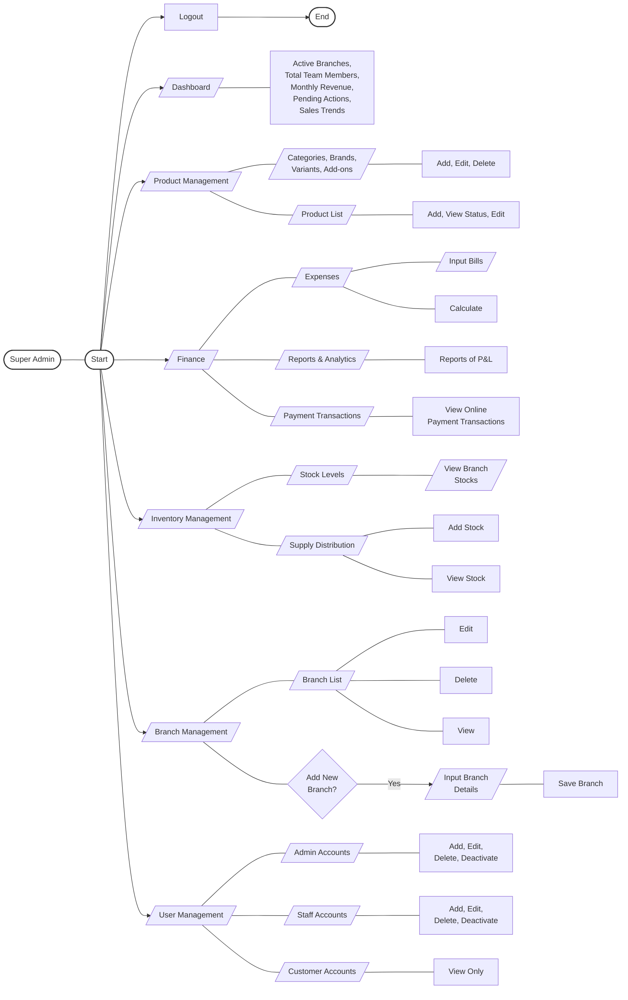

# Super Admin Detailed Workflow (Readable LR View)

This version uses a **Left-to-Right (LR)** layout. This is the only way to ensure the text is large and readable in a narrow preview window while keeping the entire "single tree" structure of your example.

