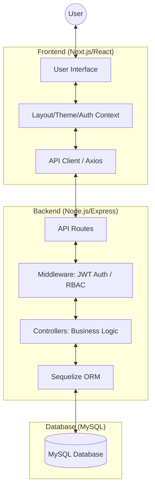
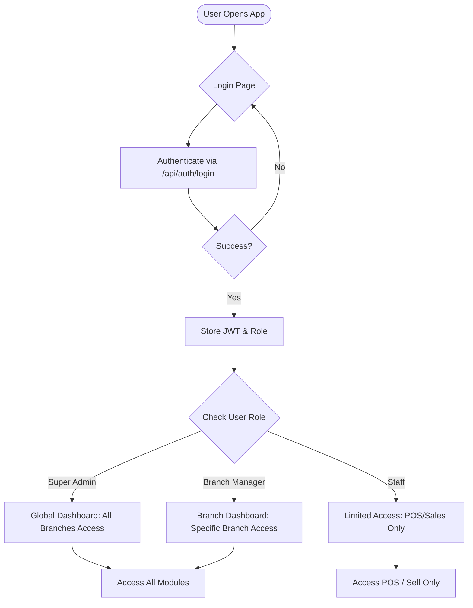
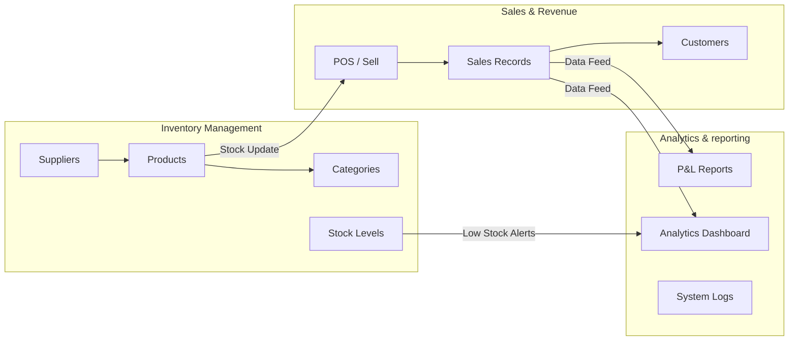
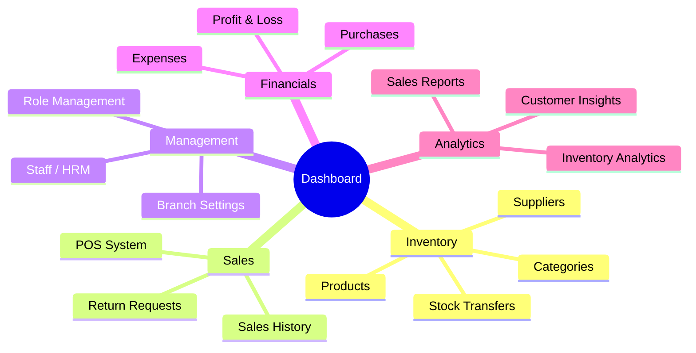

# PC Alley ERP System Flowchart

This document provides a visual representation of the system architecture and functional workflows of the PC Alley ERP system.

## 1. System Architecture
This diagram shows the high-level technical stack and how data flows between the user interface and the database.

---

## 2. Authentication & Authorization (RBAC) Flow
How the system handles user entry and restricts access based on roles.

---

## 3. Core Functional Modules
Detailed view of how different modules interact within the ERP system.

---

## 4. Navigation Structure
Overview of the sidebar navigation available to administrators.

